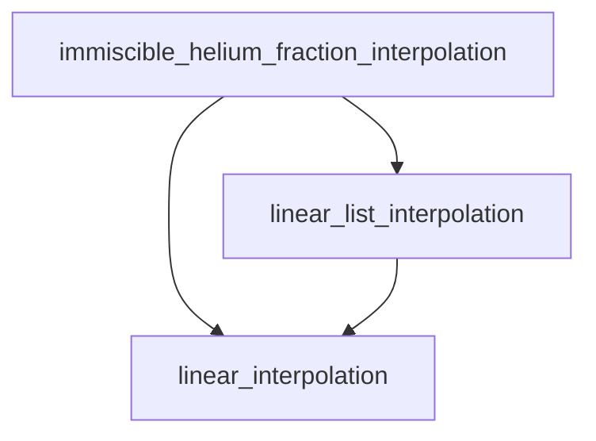

# Details

## Files
- `element_sedimentation.f90`: The main Fortran module implementing element sedimentation.
- `controls.defaults`: Default controls/documentation for the element sedimentation module.
- `ctrls_io.f90`: File containing the assignment of the new star_info variables.
- `evolve.f90`: The main evolution loop that calls the element sedimentation module.
- `star_data_step_work.inc`: Other star_type variables that are used by the element sedimentation module but are not a user input.
- `alloc.f90`: Allocates `s% eps_element_sedimentation`.
- `init.f90`: Calls `shutdown_phase_diagram` and `init_element_sedimentation`.
- `makefile_base`: Add `element_sedimentation.f90` to the list of source files to compile.
- `star_controls.inc`: Contains the type definitions for the new controls used by the element sedimentation module.

## new variables besides options
- `s% eps_element_sedimentation` for energy accounting of the element sedimentation process.
- `s% total_energy_from_element_sedimentation` for accounting of the total energy released by the element sedimentation process.

## Function overview
The code computes an array $dY$, that is the change in the helium mass fraction due to sedimentation. Once obtained, the mass abundances are changed according to
$$dX_i = \frac{- dY}{1-Y} X_i$$
where $X_i$ is the mass fraction of the $i$-th chemical species and $Y$ is the helium mass fraction.
### immiscible_helium_fraction_interpolation

`immiscible_helium_fraction_interpolation` is a core routine for determining the boundaries of helium immiscibility as a function of pressure and temperature. It interpolates values from a given phase diagram table and returns the minimum and maximum helium mass fractions for which the material is immiscible.

#### Purpose

This function takes a given pressure (`P0`) and temperature (`T0`) and, by interpolating within the phase diagram, determines the corresponding values for `Y_min` and `Y_max`. These values define the range of helium mass fraction where the material is immiscible. If the current helium content is outside this range, the material is fully miscible.

#### How it works

- **Inputs:**  
  - Pressure `P0` (in cgs units)
  - Temperature `T0` (in cgs units)
  - Phase diagram data structure `pd`
- **Outputs:**  
  - `Y_min`, `Y_max`: immiscibility boundaries
  - `ierr`: error code

The routine first finds the appropriate pressure and temperature intervals in the phase diagram and then uses linear interpolation to determine `Y_min` and `Y_max`. The helper functions `linear_list_interpolation` and `linear_interpolation` are called during this process.

#### Flow chart



#### Example usage

```fortran
call immiscible_helium_fraction_interpolation(P0, T0, pd, Y_min, Y_max, ierr)
```

#### Notes

- The function assumes that the phase diagram is loaded and consistent.
- Errors are indicated via the `ierr` return value.